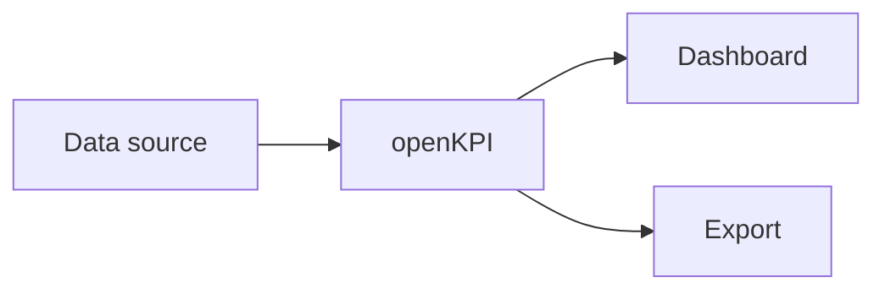

# Introduction

openKPI is a platform for collecting and visualizing
Key Performance Indicators (KPIs). This introduction gives a
high-level overview of the architecture and the underlying concepts.

## Concepts

- **Data source**: A system that values are read from.
- **Metric**: A single, measurable value over time.
- **Dashboard**: A collection of metrics in visual form.

## Example

A simple example as a code block:

```ts
import { defineMetric } from 'openkpi'

export const activeUsers = defineMetric({
  name: 'active_users',
  unit: 'count',
  description: 'Number of active users per day'
})
```

## Diagram (Mermaid-style)



## Further Reading

Continue with the [Core KPI](./core-kpi) page.
