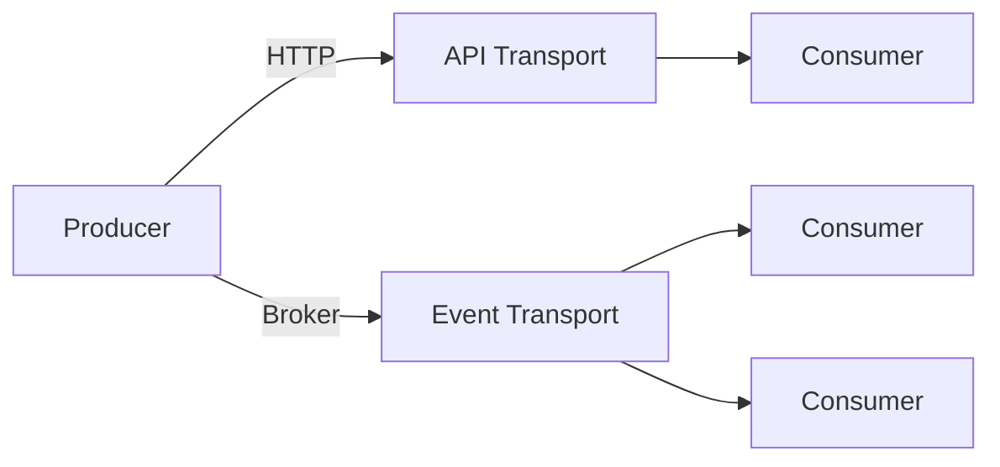

# Transport

The transport layer of openKPI defines *how* KPI documents move
between producers and consumers. The data model itself — described in
[Core KPI](../core-kpi) — is transport-agnostic: the same JSON
document can be served from an HTTP endpoint, published as an event
on a message broker or written to a file.

The specification standardises two complementary transports:

| Transport            | Model         | Direction       | Typical Use                           |
| -------------------- | ------------- | --------------- | ------------------------------------- |
| [API](./api)         | Pull          | Synchronous     | Dashboards, ad-hoc queries, exports   |
| [Event](./event)     | Push          | Asynchronous    | Real-time updates, fan-out to many    |

Both transports carry the **same** Core KPI payload — only the
delivery mechanism differs. Implementations are free to expose one or
both, and consumers can mix them as needed.

## Choosing a Transport

Use the [API](./api) transport when:

- Consumers want to fetch values on demand
- Caching, pagination or historical range queries matter
- The integration follows a request/response pattern

Use the [Event](./event) transport when:

- Values must propagate to consumers as soon as they are produced
- Multiple, independent consumers subscribe to the same KPI
- Producer and consumer should stay decoupled

## Common Guarantees

Regardless of the transport, every openKPI exchange must:

- carry a complete, schema-valid Core KPI document as its payload,
- preserve `id`, `unit`, `aggregation` and `time_window` exactly as
  produced — transports never rewrite semantic fields,
- use UTF-8 encoded JSON as the wire format.

Continue with the [API](./api) or [Event](./event) transport for the
concrete wire format.
